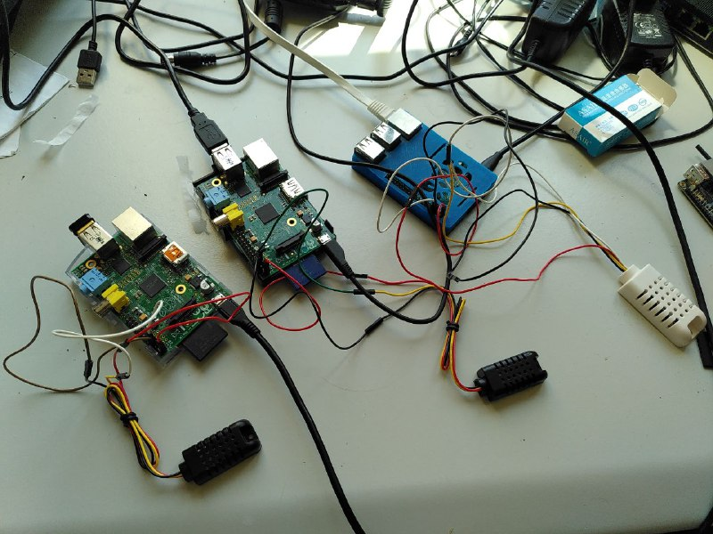
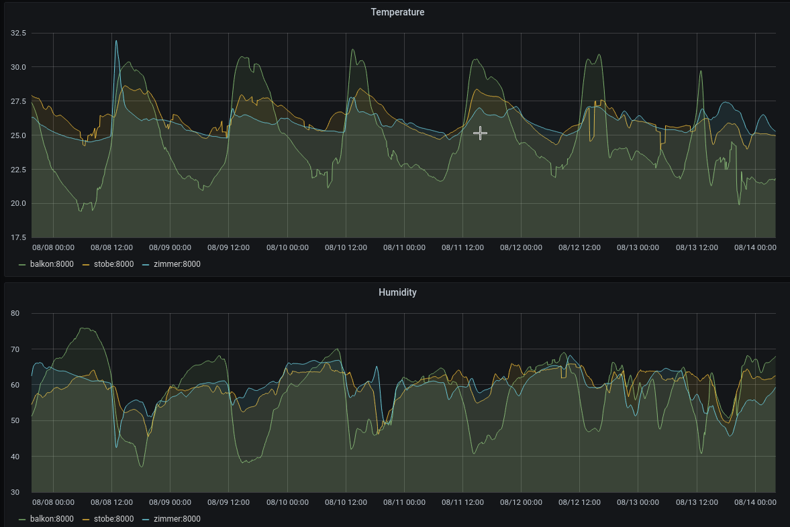

# Home Weather station
Monitoring temperature and humidity indoors and outdoors at home. For fun and also reviving some old and no longer used Raspberry Pi Models 1 & 2.

Super simple setup using a couple Raspberry Pis and prometheus + grafana inside a [k3s](https://k3s.io/) node.

# How to use this
* Install the script found in the `probe` directory together with a [compatible sensor](https://learn.adafruit.com/dht/overview) on your Raspberry Pi devices.
* Install a `k3s` cluster somewhere (this can be one of your sensor probe Pi if you are using Model 2B or newer since `k3s` is super lightweight) using the official install script
* Adjust the scrape target configuration inside `manifests/prometheus.yaml` to match your network/device configuration
* Copy over the files from the `manifests` directory to `/var/lib/rancher/k3s/server/manifests`. This will automatically deploy prometheus and grafana
* Set your `/etc/hosts` file or DNS to point `weather.station`  to your cluster node IP address
* Grab the grafana admin password from the grafana installer pod logs (this pod should be in `completed` state in the `kube-system` namespace)
* Add `http://probes-prometheus-server` as log source
* Build your dashboards \o/ Or if you are lazy enough just import `dashboard-weather.json`

# Installing k3s with UFW
Taken from [this issue](https://github.com/rancher/k3s/issues/1280). If `k3s` fails to bootstrap itself while spitting weird network errors into `journalctl -u k3s`:
```
sudo ufw allow from 10.42.0.0/16 to any
sudo ufw allow from 10.43.0.0/16 to any
```

# First impressions



